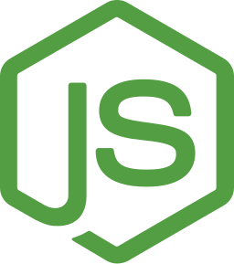

### Hey there 👋

Welcome to my GitHub! I am Jicson, a penultimate computer science undergraduate from NUS and a passionate software developer. I enjoy tackling challenging problems and trying out new technologies to build innovative solutions. 

Feel free to check out my repositories and if you find anything interesting or have any questions, I'd be happy to connect and collaborate. Let's build something great together!

**Tech Skills:**

  
  &nbsp;
  
  &nbsp;
  
  &nbsp;
  
  &nbsp;
  
  &nbsp;
  
  &nbsp;
  
  &nbsp;
  
  &nbsp;
  
  

### Reach out to me 🙂

- Visit my personal site, [jicson.com](https://jicson.netlify.app)
- Connect with me, [LinkedIn](https://www.linkedin.com/in/jicsontoh/) 

<!--
**jicsontoh/jicsontoh** is a ✨ _special_ ✨ repository because its `README.md` (this file) appears on your GitHub profile.

Here are some ideas to get you started:

- 🔭 I’m currently working on ...
- 🌱 I’m currently learning ...
- 👯 I’m looking to collaborate on ...
- 🤔 I’m looking for help with ...
- 💬 Ask me about ...
- 📫 How to reach me: ...
- 😄 Pronouns: ...
- ⚡ Fun fact: ...
-->
